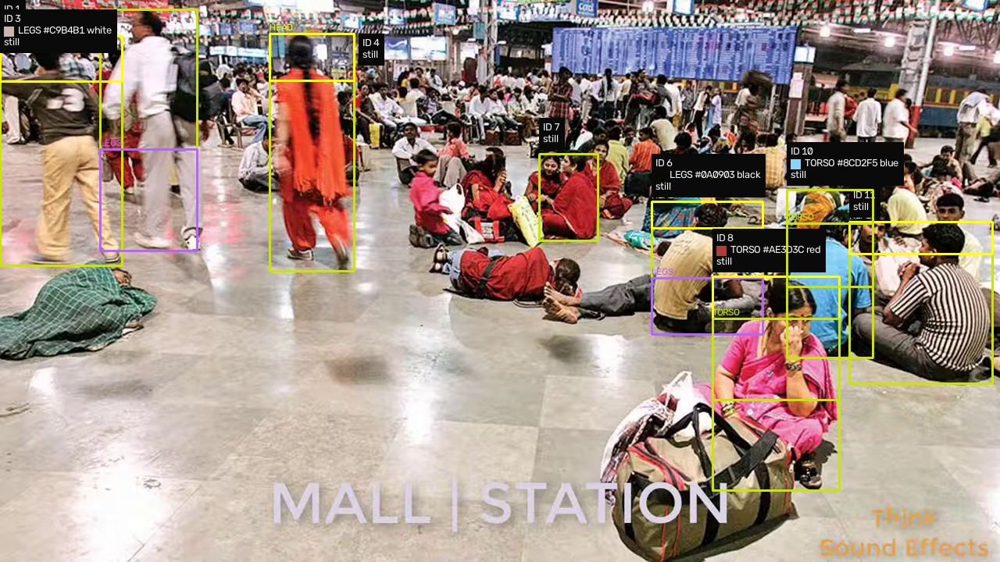
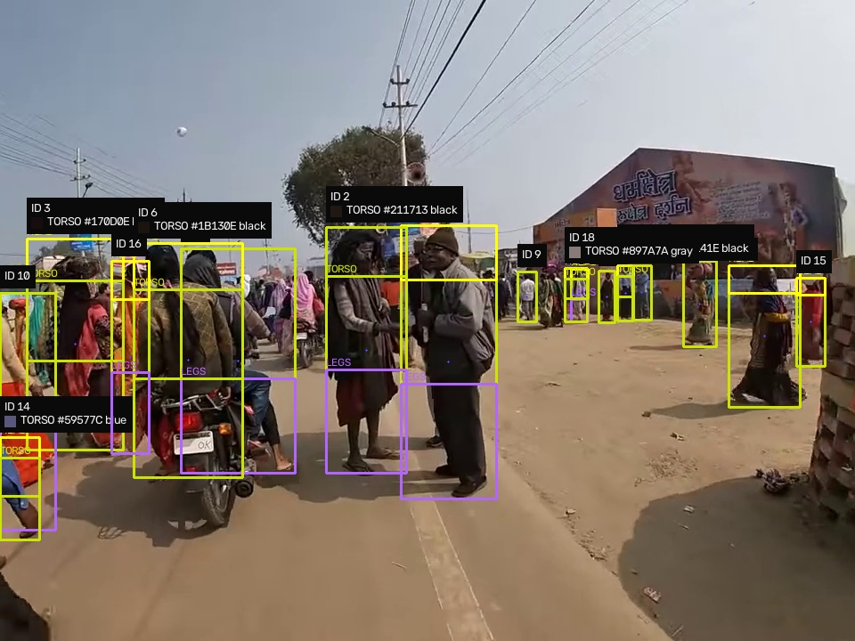
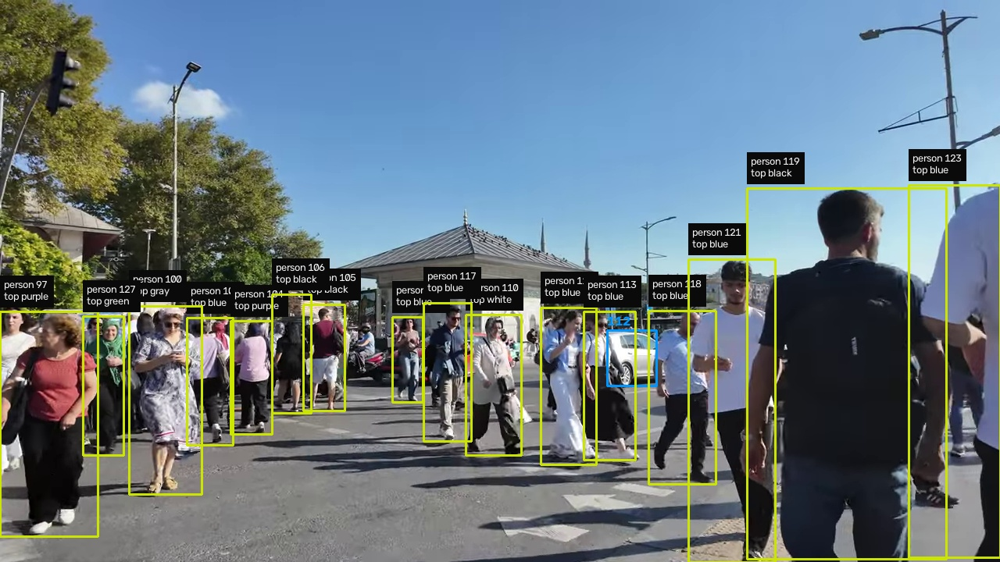

# Raksha Command Center: Crowd Safety (Hackathon 2026, Problem #2)

## What we are building
A smart crowd safety system for large public events (concerts, festivals, stations, stadiums).

Today, control rooms watch dozens of CCTV screens by hand. People get missed, crushes get spotted too late. Raksha changes that:

1. **Live tracking.** Every person gets a stable ID that stays with them across cameras, even in dense crowds.
2. **Instant person file.** The moment a face is seen clearly, a card pops up: photo, clothing, where they entered, how long they stayed.
3. **Stampede meter.** The system watches density, stillness, and opposite flows. When risk turns red, guards get an alert in under 1 second with the exact zone.

Same idea as advanced camera systems used abroad, but built privacy first: opt in enrollment, blurred stored video, auto deletion, no ID card linkage, full audit log.

## What works today (tested on our laptop, RTX 4050)
- Live wall in browser: camera feed with ID boxes, walking trails, zone counts, stay timers. Open `http://localhost:8000/wall.html` after starting the backend. Preview: `docs/wall-preview.png`.
- Tracking: YOLOv8s plus ByteTrack, 15 to 30 FPS. ID holds through short blockages (tested: 60 frame blackout, same ID back).
- Face file: enroll with webcam (`scripts/enroll.py`), live match at 61 ms per face on GPU, card pops with photo, age, stay time. Unknown faces go to one stranger file, no spam.
- Stampede meter: fired RED (1.2 plus) on dense test input. Alerts go to the wall plus a log file for handover.
- Snapshots: best face crops saved per person, shown inside their card on the wall.
- Deck: 6 slides in official template, validated. PDF ready in `deck/`.

## What is left
- [ ] Team leader name on slide 1, then re export PDF and upload to portal (needs: one name)
- [x] Dense crowd test with many people (done: Indian station plus temple plus traffic clips, see Crowd tests)
- [ ] Long gap body matching: our face file covers cross camera identity, body only matching past 6 seconds is still open
- [ ] Stranger grouping polish: strangers share one file today, split them if time allows
- [ ] Demo video: record the wall during a walk through plus a face search moment
- [ ] Optional speedups: TensorRT export, smaller input size, ONNX runtime tuning (works fine without these)

## Crowd tests (real footage, our tracker)
We ran the live tracker end to end on real crowd clips, including Indian railway station and temple footage. Same code as the wall, no tuning per clip.

| Clip | Frames | Speed | People at once (peak) | Total IDs seen |
|---|---|---|---|---|
| Indian railway station | 4451 | 27 to 29 FPS | 9 | 37 |
| Kumbh temple area | 1799 | 29 to 33 FPS | 17 | 543 |
| City traffic (people plus vehicles) | 924 | 49 to 55 FPS | 23 | 226 people, 67 vehicles (cars, bikes, trucks, bus) |

Crowds plus vehicles are tracked together. Every person gets head, torso and legs boxes, each part measured for its real color with a swatch plus hex in the panel. Vehicles get blue boxes with type plus direction panels. Number plates are not read yet, that is listed below.

<video src="https://github.com/shounakjoshi88-a11y/raksha-crowd-safety-hackathon/raw/main/docs/demo/tracking_demo.mp4" controls width="100%">
  <a href="https://github.com/shounakjoshi88-a11y/raksha-crowd-safety-hackathon/blob/main/docs/demo/tracking_demo.mp4">Watch: live tracking on street traffic</a>
</video>

*Watch: live tracking on street traffic. Every box carries its file panel. If the player above does not load, use the link inside it.*


*Indian railway station: part boxes on every person, true colors (white shirts read white, red saris read red).*


*Temple crowd: 17 tracked at once with file panels.*


*Street traffic: people plus cars, bikes and trucks tracked together.*

Honest note: total IDs are higher than real people because IDs sometimes restart in very dense scenes (known ByteTrack tradeoff without appearance matching). Peak simultaneous count is the solid number. Colors read true on clear views, seated overlapping rows can still misread (documented hard case in attribute research), and weak guesses are dropped instead of shown. Face files fix identity across cameras regardless.

Test clips stay on our machines only. Rerun anytime with `python scripts/test_clips.py` or `python scripts/test_india.py`.

## How to run it
```powershell
# 1. Start the backend (needs webcam, runs the full loop)
python D:\Q_project\raksha\backend\app.py
# 2. Open in browser
http://localhost:8000/wall.html
# 3. Enroll a face (new terminal, look at camera)
python D:\Q_project\scripts\enroll.py YourName 5
# 4. Check speed
python D:\Q_project\scripts\bench_track.py 0 120
```
First run downloads models automatically (YOLO 21 MB, face pack 159 MB). Needs NVIDIA GPU for full speed, works on CPU slower.

## How we scale this (plain words)
Today everything runs on one laptop with one camera. That is fine for the demo. Here is how the same design grows, step by step, with no rewrite:

1. **More cameras, same laptop.** The tracker already keeps one state per camera. Add a second webcam or CCTV stream as a new source. Face files are shared, so a person seen on camera A is already known on camera B.
2. **Small edge boxes per gate.** A Jetson Orin Nano (about $250, 15 watts) runs detection plus tracking for 4 cameras at the gate itself. It sends only snapshots and numbers upward, not full video. This is exactly how large systems keep network load tiny.
3. **One GPU server per venue.** Our backend becomes the venue server: many edge boxes feed it, Faiss gallery grows from flat search to indexed search (same code, one setting change), snapshots go to shared storage, alerts fan out to guard phones.
4. **City level.** Many venue servers feed one search cluster (Milvus vector database plus Kafka message bus). Face search across millions stays under a second. Video stays at the edge, only snapshots and alerts travel.
5. **What changes in code at each step:** almost nothing. Same detector, same tracker, same gallery interface, same alert format. Only the deployment around it grows: more boxes, bigger gallery index, shared storage.

Rough math for the pitch: one camera at 1080p needs about 2 Mbps. 8 cameras need 16 Mbps, fine on normal wifi. Snapshots are tiny (10 thousand faces a day is about 1 GB). A 2 TB drive holds months of snapshots plus a week of video.

## What is inside this repo
| File or folder | What it is | Who should read it |
|---|---|---|
| `deck/Raksha_Hackathon2026_Final.pptx` | Our 6 slide submission deck, filled in the official college template | Everyone, this is what judges see |
| `deck/Raksha_Hackathon2026_Final.pdf` | Same deck as PDF, this is what gets uploaded to the portal | Everyone |
| `deck/HACKATHON 2026.pptx` | The blank official template, keep as reference | Anyone editing slides |
| `docs/Hackathon Problem Statement .md` | All 6 problem statements in text form | Everyone |
| `docs/plan.md` | Living build tracker with checkboxes, updated as phases complete | Everyone, check this to see what is done and what is left |
| `docs/RESEARCH.md` | Build bible: best GitHub repos to copy from, papers, datasets, settings that work, build order | Builders (vision plus backend) |
| `docs/CHINA_DEEP_DIVE.md` | Deep notes on how large scale camera systems work behind the scenes | Builders who want full context |
| `raksha/` | Working code: live vision, backend API, wall UI, run notes, demo script | Builders |
| `scripts/` | Dev helpers: env check, FPS benchmark, live wall, enroll, match test, ReID test | Builders |
| `.agents/skills/` | 8 installed AI skills: slide making, UI design, computer vision, debugging, brainstorming | Everyone, these make the AI agent much better |

## Skills folder, simple explanation
The `.agents/skills/` folder teaches our AI assistant how to do expert work:

- `pptx`: making and fixing PowerPoint decks the correct way, with checks.
- `frontend-design`, `ui-ux-pro-max`, `web-design-guidelines`: making the control room dashboard look clean and professional, not generic.
- `computer-vision-opencv`, `senior-computer-vision`: building the camera AI (detection, tracking, face matching, speed tricks).
- `brainstorming`: thinking through ideas before coding.
- `systematic-debugging`: fixing bugs by finding the root cause first.

Rule for the team: when anyone installs or updates a skill, copy the fresh `.agents/skills/<name>` folder into this repo and commit it, so everyone stays in sync. Restore everything on a new machine with the commands in the Skills section below.

## Skills: install and update commands
```powershell
npx -y skills add https://github.com/anthropics/skills --skill pptx -g -y
npx -y skills add https://github.com/anthropics/skills --skill frontend-design -g -y
npx -y skills add https://github.com/nextlevelbuilder/ui-ux-pro-max-skill --skill ui-ux-pro-max -g -y
npx -y skills add https://github.com/vercel-labs/agent-skills --skill web-design-guidelines -g -y
npx -y skills add https://github.com/obra/superpowers --skill brainstorming -g -y
npx -y skills add https://github.com/obra/superpowers --skill systematic-debugging -g -y
npx -y skills add mindrally/skills@computer-vision-opencv -g -y
npx -y skills add alirezarezvani/claude-skills@senior-computer-vision -g -y
```

## How to contribute
1. Clone the repo, make a branch with your name or task (example: `ananya/heatmap-ui`).
2. Keep it clean: never commit scratch files, `node_modules`, thumbnails, research clones, model weights, or face galleries. `.gitignore` already blocks most of these.
3. Never commit real face photos or gallery files. Biometric data stays on your own machine only.
4. Skill updates go in `.agents/skills/<name>` and get committed like normal code.
5. Open a pull request with a one line summary of what changed. Small PRs get merged fast.

## Team
- Team name: Team Raksha
- Problem statement: No. 2, Improving Safety at Large Public Events
- Team Leader: (adding tomorrow)
- Members: (add names here)
